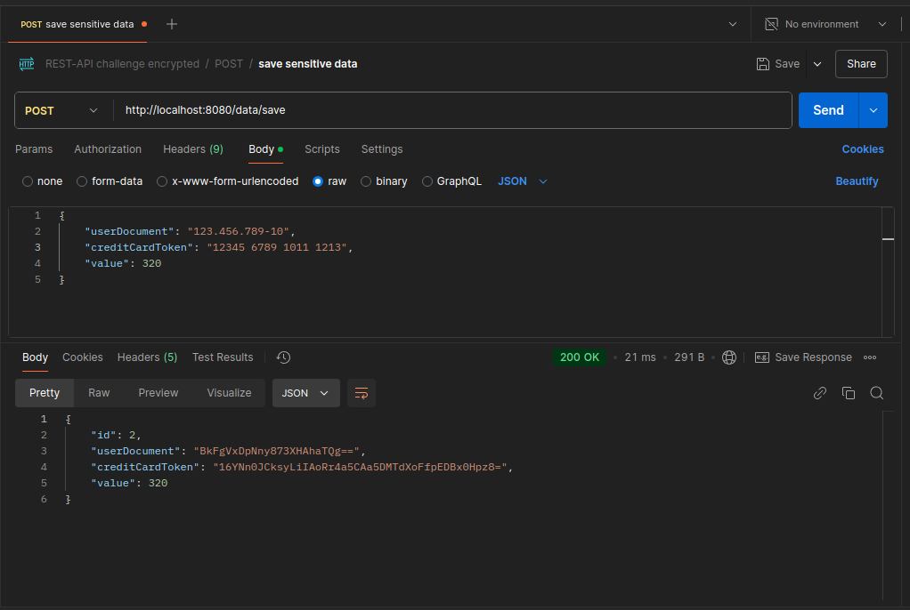
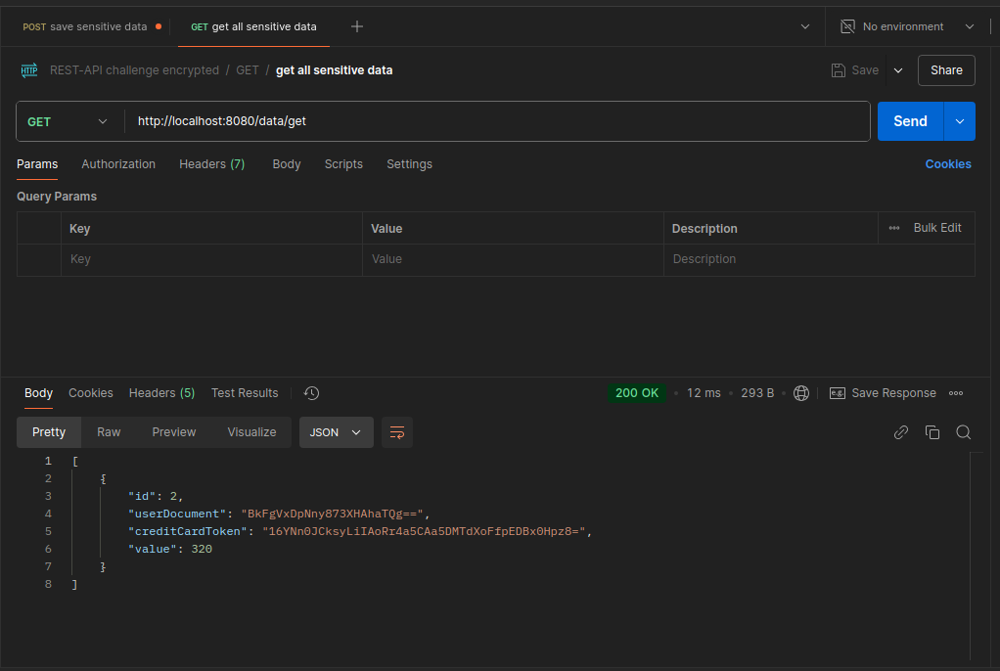
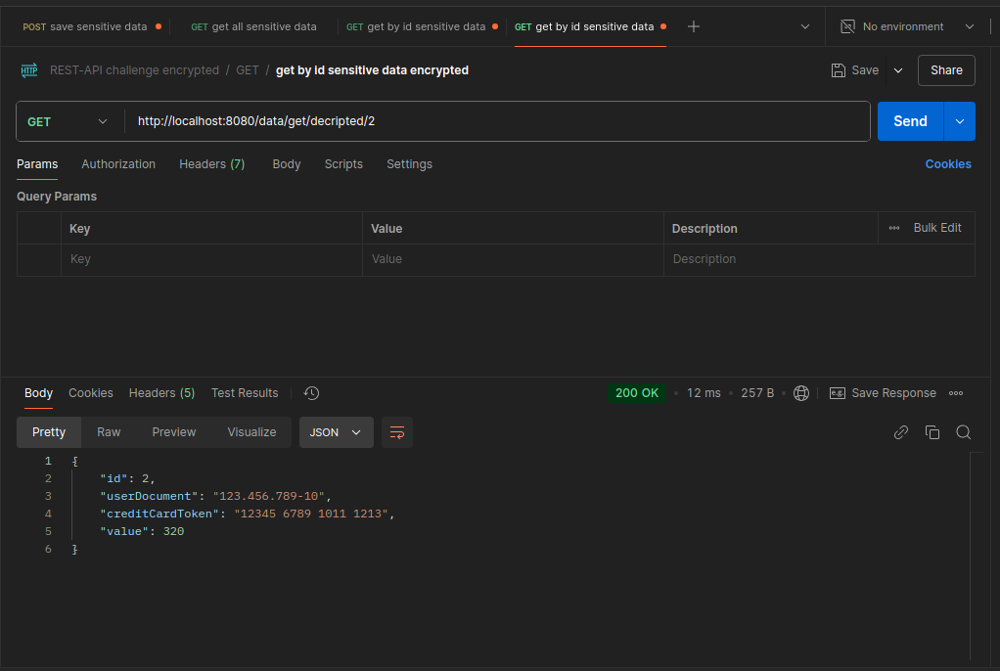
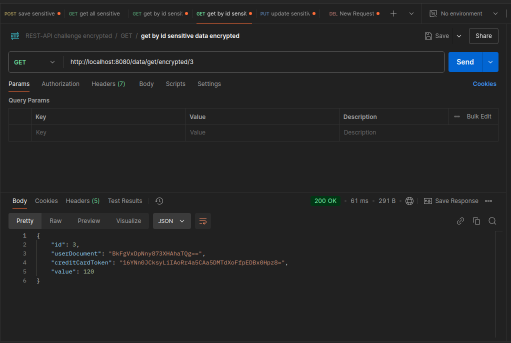
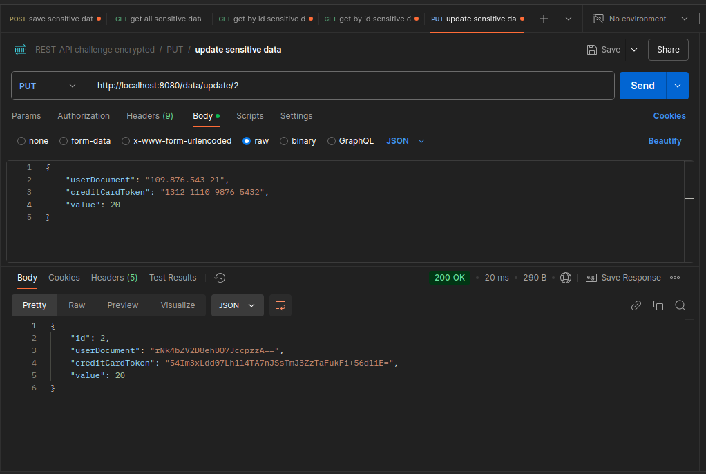
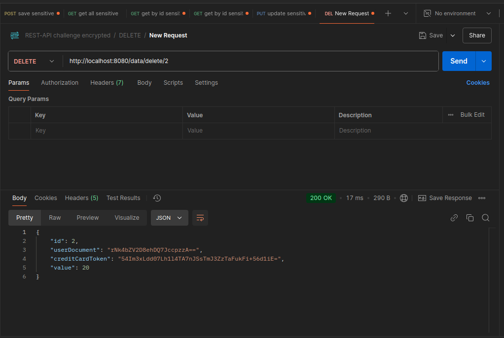

# API - Gerenciamento de Dados Sensíveis
Esta API foi desenvolvida como parte de um desafio técnico e tem como objetivo armazenar, criptografar e gerenciar dados sensíveis de forma segura. Foi construída utilizando Java Spring Boot com foco em boas práticas e segurança.

🔗 Link do Desafio: https://github.com/backend-br/desafios/blob/master/cryptography/PROBLEM.md

## **Tecnologias Utilizadas**
- Java Spring Boot
- Spring Data JPA
- Spring Web
- PostgreSQL
- AES Encryption para criptografia simétrica de dados sensíveis
- Hibernate para ORM
- Maven para gerenciamento de dependências

### **Gerenciamento de Dados Sensíveis**
**Endpoint principal:** `/data`

| **Método** | **Endpoint**                 | **Descrição**                                  | **Corpo da Requisição**                             | **Testando Enpoints**                                           |
|------------|-------------------------------|------------------------------------------------|-----------------------------------------------------|-----------------------------------------------------------------|
| **POST**   | `/save`                      | Salva dados sensíveis criptografados.          | `{ "userDocument": "...", "creditCardToken": "...", "value": ... }` |                    |
| **GET**    | `/get`                       | Retorna todos sensitiveData (criptografados). | -                                                   |               |
| **GET**    | `/get/decripted/{id}`        | Retorna dados descriptografados por ID.        | -                                                   |   |
| **GET**    | `/get/encrypted/{id}`        | Retorna dados criptografados por ID.           | -                                                   | |
| **PUT**    | `/update/{id}`               | Atualiza sensitiveData por ID.                 | `{ "userDocument": "...", "creditCardToken": "...", "value": ... }` |                    |
| **DELETE** | `/delete/{id}`               | Deleta sensitiveData por ID.                 | -                                                   |              |

## Criptografia AES
O projeto utiliza o algoritmo AES (Advanced Encryption Standard) para garantir a segurança das informações sensíveis armazenadas no banco de dados.

### **Testando os Endpoints com Postman**

#### **POST /save**
Teste de criação de dados sensíveis criptografados:


#### **GET /get**
Retorno de todos os dados sensíveis criptografados:


#### **GET /get/decrypted/{id}**
Retorno de dados descriptografados por ID:


#### **GET /get/encrypted/{id}**
Retorno de dados criptografados por ID:


#### **PUT /update/{id}**
Atualização de dados sensíveis:


#### **DELETE /delete/{id}**
Deletação de dados sensíveis por ID:


---

## **Configuração e Execução**

1. **Clone o repositório:**
   ```bash
   git clone https://github.com/EricSouzaDosSantos/desafio-de-criptografia-spring.git
   cd desafio-de-criptografia-spring
   ```
   
2. **Configure as variáveis de ambiente do arquivo application.properties**
    ```
   spring.application.name=encryption

    #database settings
    spring.datasource.url=${DB_URL}
    spring.datasource.password=${DB_PASSWORD}
    spring.datasource.username=${DB_USER}
    spring.datasource.driver-class-name=org.postgresql.Driver
    spring.jpa.hibernate.ddl-auto=update
    spring.jpa.properties.hibernate.dialect=org.hibernate.dialect.PostgreSQLDialect
    
    # log SQL
    spring.jpa.show-sql=true
    
    spring.jpa.properties.hibernate.format_sql=true
    
    # settings AES
    api.security.algorithm.encrypt=${ENCRYPT_TYPE}
    api.security.key.encrypt=${ENCRYPT_KEY}

   ```
3. **Execute o projeto**
    - com maven
      ```
      mvn spring-boot:run
      ```
    - Ou direto pela IDE
4. **Testar endpoints**
- Utilize ferramentas como Postman ou Insomnia para testar os endpoints.

## Desafio
Esse projeto foi desenvolvido como parte de um desafio técnico.<br>
Link do Desafio: https://github.com/backend-br/desafios/blob/master/cryptography/PROBLEM.md

## Contribuição
Sinta-se à vontade para contribuir com sugestões, correções de bugs ou novas funcionalidades.

